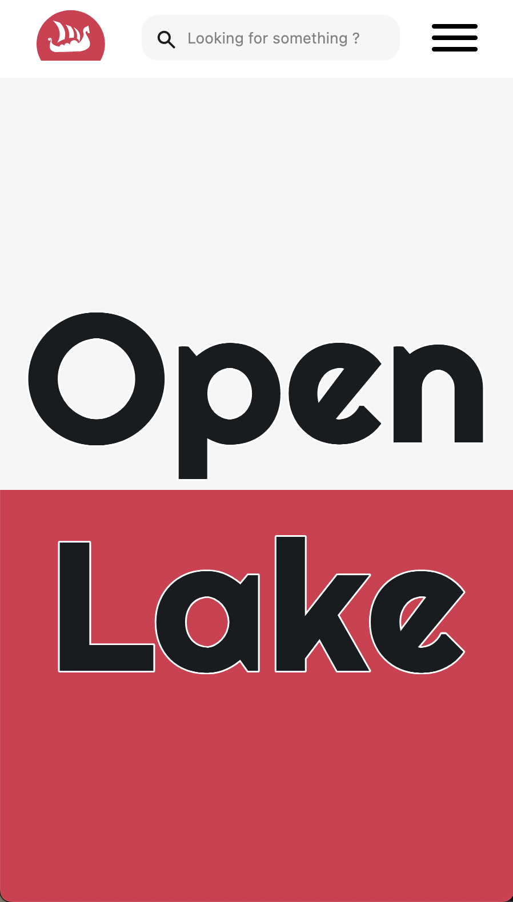
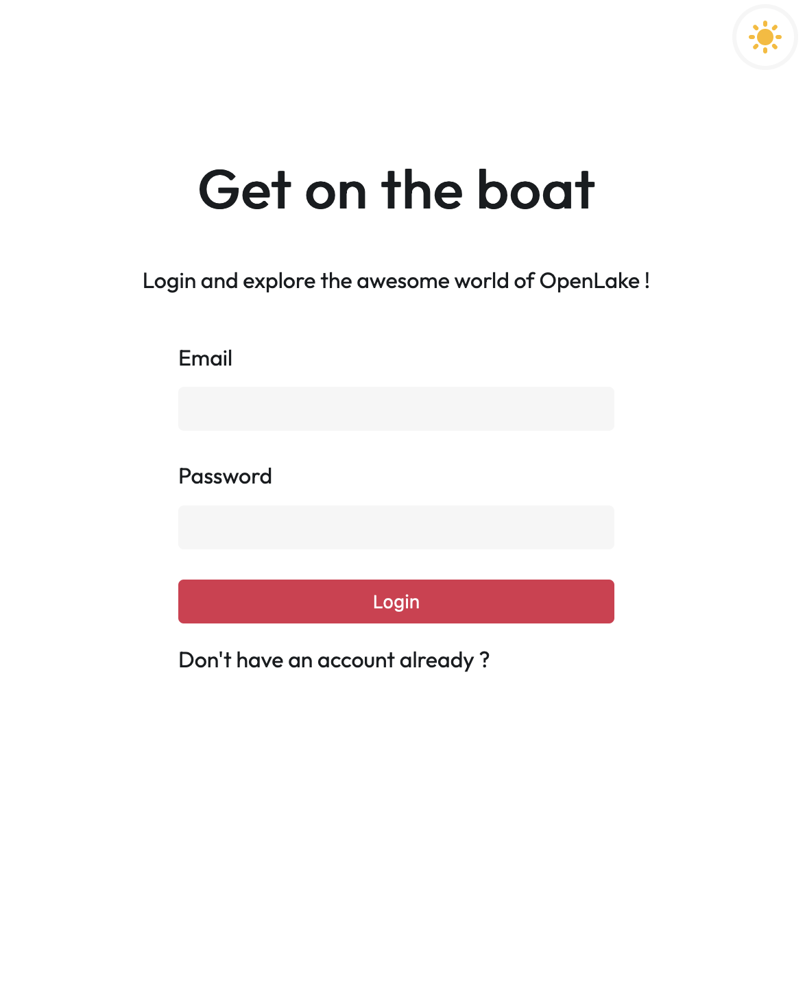
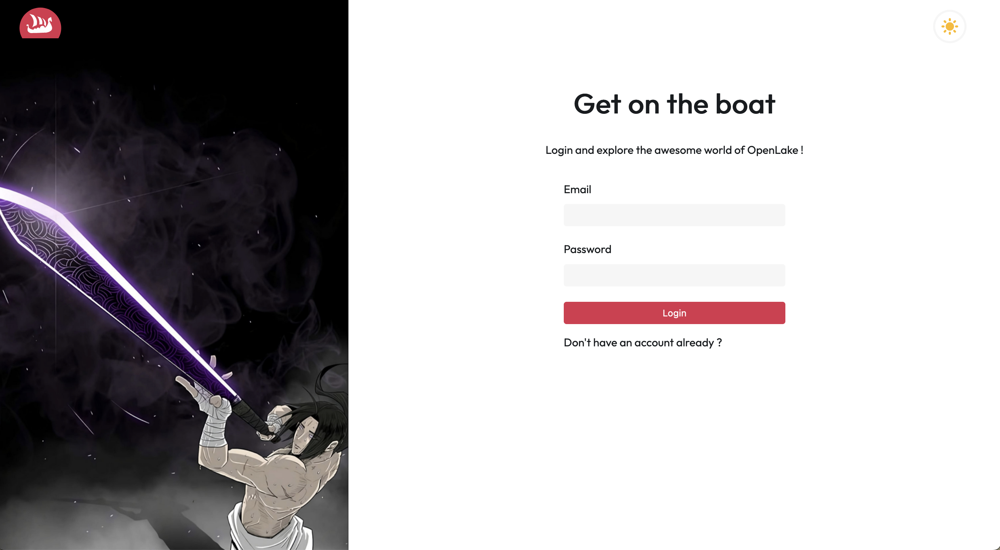
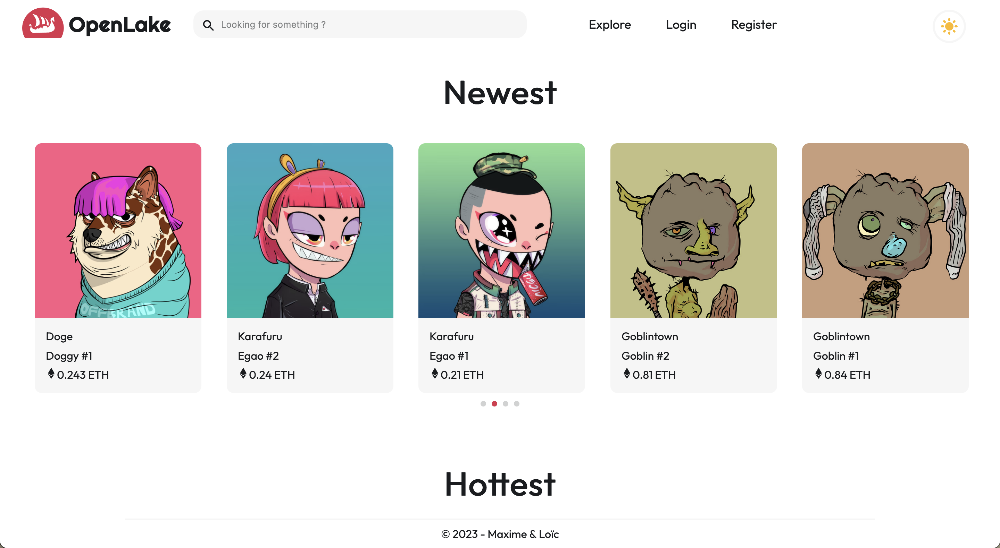

# OpenLake

#### Table of Contents

-   [Project UI](#ui)
-   [Functionnalities](#functionnalities)
-   [Tech](#tech)
-   [Deploy](#deploy)

---

## Description
A website to fake the buying, selling, collection of NFT. Basically a NFT Marketplace. Like OpenSea.

## UI

## Functionnalities
A basic list of functionality the app has:
- User can register / login on the website.
- User can explore the market.
- User can look into a single card & buy or sell if he already has it in his collection.
- User can deposit or withdraw money (fake).
- User can see his own collection and his historic of transaction (bought and sold).
- User can update his profile.
- If the nft has already been bought by someone it's unavailable for the other users.

## Tech 
- Working with a Next.js and Node.js
- Using npm for the packages.
- Routing
- Responsive design
- Mangodb

## Deploy
 Deployed on DigitalOcean [https://openlake-rr6xf.ondigitalocean.app/](https://openlake-rr6xf.ondigitalocean.app/)

